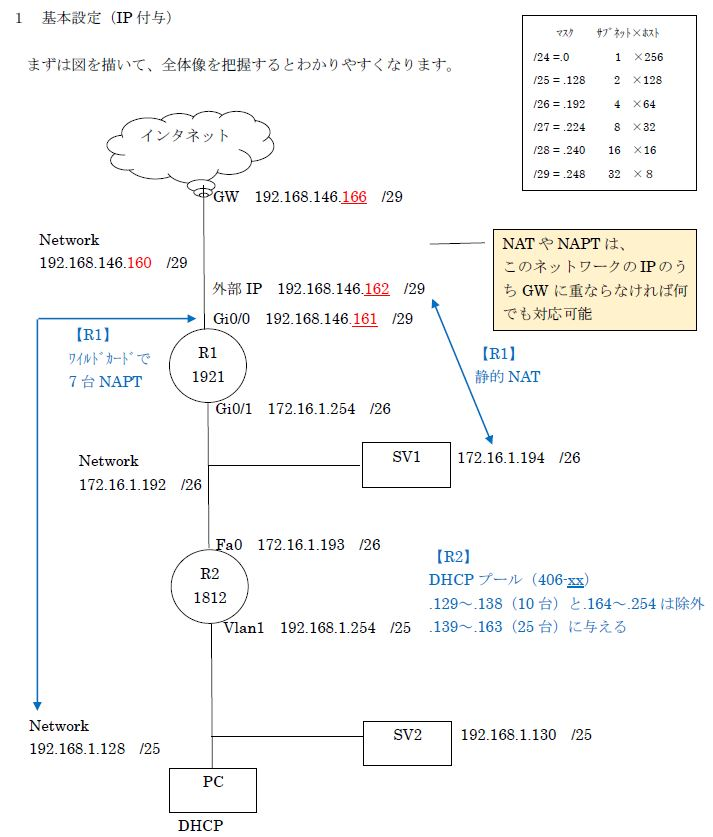

# Dockerを使用したサーバ構築

## 注意事項

※作成前に、現在のイメージ及びコンテナを削除

- ネットワークやポートのかぶりがあるとめんどくさい
- 分からない場合、以前作ったものを全て削除しておいた方が楽

## 実証

- クライアントPCの設定
    - IPアドレス：自動取得（192.168.1.139～）
    - 優先DNSサーバ：自動取得（192.168.1.130）
    - プロキシ(192.168.1.130:8080)

- クライアントPCでの実証
    - ブラウザでYahoo!などのインターネットアクセス可能
    - `www.j21.jyoho.com`でWebページの表示
    - `192.168.1.130`でWebページの表示

